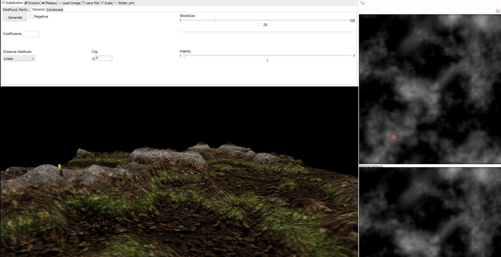

TerrainSimulator
===============

TerrainSimulator is a tool for generating terrains using and mixing different algorithms, like
Perlin Noise and Voronoi Cells. It especially provides different terrain erosion algorithms, including 
thermal erosion, water flow erosion simulation. 

Terrain modifications are made on a heightmap, which can be imported and exported. 
Also .obj models can be imported and exported.

Building the project requires wxWidgets and freeglut.
